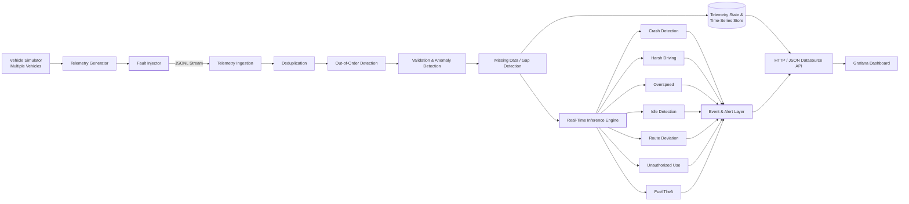
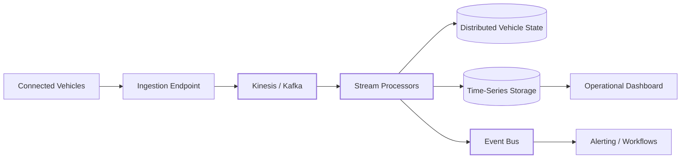

# Telemetrix

### Connected Vehicle Intelligence Platform

> **Turn unreliable vehicle telemetry into trustworthy, real-time fleet decisions.**

Telemetrix is a real-time connected-vehicle intelligence platform built for fleet operators who receive large volumes of telemetry but need actionable events rather than raw data.

The system continuously generates and processes telemetry from multiple vehicles, handles common real-world telemetry failures, and detects operational events such as crashes, dangerous driving, route deviation, unauthorized vehicle use, idling, and suspected fuel theft.

The key design principle is simple:

**Vehicle data is not inherently trustworthy. Product decisions should not depend on blindly trusting it.**

---

## Problem

Modern fleet vehicles continuously produce telemetry including:

* Location
* Speed
* Fuel or battery level
* Odometer
* Engine state
* Diagnostic trouble codes
* Vehicle timestamps
* Signal quality and other contextual information

For a large fleet, this quickly becomes a high-volume stream of data. Fleet operators, however, generally do not need another collection of graphs showing what every vehicle is doing.

They need answers to questions such as:

* Did a vehicle crash?
* Is a driver repeatedly driving dangerously?
* Is a vehicle being used outside its expected route?
* Is fuel disappearing while the vehicle is stationary?
* Is a vehicle being used without authorization?
* Has a vehicle stopped sending reliable telemetry?
* Can an operator trust the event that was just generated?

Telemetrix focuses on converting the raw telemetry stream into **specific, timely operational events**, while accounting for the fact that real vehicle telemetry can be duplicated, delayed, missing, or outright invalid.

---

# Architecture



## Data Flow

1. **Vehicle Simulator** generates telemetry for multiple vehicles.
2. **Fault Injection** can introduce realistic telemetry failures on demand.
3. **Ingestion** receives the resulting stream.
4. **Deduplication** prevents modem resends from being processed twice.
5. **Out-of-order handling** prevents stale telemetry from corrupting current vehicle state.
6. **Validation** identifies physically or structurally invalid readings.
7. **Gap detection** identifies missing telemetry.
8. Accepted telemetry updates the vehicle's time-series state.
9. The **Inference Engine** processes trusted, in-order observations.
10. Detected conditions become structured **events and alerts**.
11. The backend exposes telemetry and events through an HTTP/JSON datasource interface.
12. **Grafana** provides the operational dashboard.

---

# Telemetry Contract

Each generated telemetry message contains the required vehicle information:

```json
{
  "message_id": "msg_...",
  "vehicle_id": "VHC-001",
  "vehicle_timestamp": "2026-09-26T08:00:00.000Z",
  "location": {
    "lat": 13.0827,
    "lng": 80.2707,
    "heading": 90.0
  },
  "engine_status": "ON",
  "fuel_level_pct": 72.5,
  "battery_level_pct": null,
  "speed_kmh": 54.2,
  "odometer_km": 12842.7,
  "diagnostic_codes": []
}
```

Additional fields are generated to make the simulation more realistic and support product features, including:

* RPM
* Gear
* Driver ID
* Ignition state
* Signal quality
* Vehicle type
* Engine type
* Route progress
* Route deviation
* Telemetry rate
* Sequence number

---

# Handling Unreliable Vehicle Data

Real telematics systems cannot assume that every incoming message is correct.

Telemetrix explicitly handles the four failure modes required by the challenge.

## 1. Duplicate Data

A modem may resend a message that has already been received.

Telemetrix uses `message_id` for deduplication.

Duplicate messages are rejected **before they update vehicle state, throughput statistics, or business inference**.

This prevents a resend from being interpreted as a new vehicle observation.

---

## 2. Out-of-Order Data

Network delays can cause an older vehicle message to arrive after a newer one.

Telemetrix compares incoming vehicle timestamps against the newest accepted timestamp for that vehicle.

Late messages:

* Are detected and recorded
* Can still be stored at their correct historical position
* Do not become the vehicle's new current state
* Do not participate in delta-based inference

This is particularly important for rules such as harsh braking, where comparing a stale packet against the current packet could produce a completely false event.

---

## 3. Missing Data

Vehicles can temporarily lose connectivity.

Telemetrix detects telemetry gaps by comparing the observed timestamp difference with the expected telemetry interval.

A gap is considered significant when it exceeds the expected interval by a configurable factor.

Missing telemetry is treated as a **data-quality event**, rather than incorrectly interpreting the absence of data as vehicle behaviour.

---

## 4. Invalid and Anomalous Data

Vehicle sensors can produce impossible or malformed readings.

The simulator can inject examples such as:

* Negative fuel or battery levels
* Fuel or battery levels above 100%
* Impossible speeds
* Negative speed
* Invalid latitude/longitude
* Future timestamps
* Extremely old timestamps
* Invalid engine states
* Invalid odometer readings

Invalid observations are detected before they can incorrectly influence downstream inference.

---

# Real-Time Product Intelligence

Once telemetry has passed the data-quality layer, Telemetrix applies event detection rules.

## Crash Detection

A crash is inferred from a combination of signals rather than relying on a single field.

The current crash signature combines:

* `engine_status = FAULT`
* Vehicle speed below the stationary threshold
* Crash-related diagnostic trouble codes

This makes the detection more robust than simply triggering on a single diagnostic code.

---

## Harsh Braking

Harsh braking is detected using the rate of change of vehicle speed:

```text
deceleration = Δspeed / Δtime
```

A sudden enough decrease in speed is classified as a harsh-braking event.

---

## Harsh Acceleration

Similarly, sudden acceleration is detected from the rate of change of speed rather than simply checking whether the vehicle is travelling quickly.

---

## Overspeed

Overspeed is treated as a sustained condition rather than a single anomalous sample.

The prototype uses a configurable speed threshold and minimum duration.

---

## Idling

A vehicle with the engine running but effectively stationary for a sustained period is classified as idling.

This helps identify potentially wasted fuel and unnecessary engine runtime.

---

## Route Deviation

The simulator provides route progress and route deviation information.

A vehicle that remains sufficiently far outside its expected route for the configured duration generates a route-deviation event.

---

## Unauthorized Use

Unauthorized use is detected when a vehicle remains in a configured speed band for a sustained period.

This provides a basis for identifying vehicle movement outside expected operating conditions.

---

## Fuel Theft

A sudden fuel-level decrease while the vehicle is stationary can indicate possible fuel theft.

The detector combines:

* Fuel-level change
* Vehicle speed
* Temporal context

rather than treating every fuel-level change as theft.

---

# Event Severity

Detected events are categorized by operational severity:

| Severity       | Events                                              |
| -------------- | --------------------------------------------------- |
| **Critical**   | Crash, fuel theft, unauthorized use                 |
| **Warning**    | Harsh braking, harsh acceleration                   |
| **Caution**    | Overspeed, route deviation                          |
| **Info**       | Idling, low fuel, low battery                       |
| **Data Fault** | Duplicate, out-of-order, missing, invalid telemetry |

This allows the dashboard to distinguish between **vehicle incidents** and **telemetry-quality problems**.

---

# Alert Noise Control

A sustained condition should not produce hundreds of identical alerts.

Telemetrix therefore uses event-specific cooldown periods.

For example, an ongoing idle condition should produce an actionable event rather than repeatedly generating the same alert every second.

Cooldowns are configurable independently for different event types.

---

# Interactive Demo

The simulator is designed specifically for live evaluation.

It can generate telemetry for multiple vehicles and inject faults or product scenarios while the system is running.

Start the interactive generator:

```bash
python telemetrix_generator.py --vehicles 5 --interactive
```

The interactive console supports:

```text
inject <fault>
stop <fault>
trigger <scenario>[:<vehicle_id>]
list vehicles
list faults
status
help
quit
```

---

# Data Quality Demonstration

The four required telemetry failure modes can be triggered independently:

```text
inject duplicate
inject out_of_order
inject missing
inject invalid
```

They can also be enabled together.

For example:

```text
inject duplicate
inject out_of_order
inject missing
inject invalid
```

This makes the system's behaviour under unreliable telemetry directly observable during evaluation.

---

# Product Scenario Demonstration

Product scenarios can also be triggered interactively:

```text
trigger crash:VHC-003
trigger harsh_braking:VHC-002
trigger harsh_acceleration:VHC-001
trigger overspeed:VHC-004
trigger idle:VHC-002
trigger route_deviation:VHC-003
trigger unauthorized_use:VHC-001
trigger fuel_theft:VHC-005
```

The scenarios are deterministic enough to make the live demo reproducible rather than relying on random behaviour.

---

# Running the Generator

### Stream telemetry to stdout

```bash
python telemetrix_generator.py --vehicles 5 --rate 1
```

This produces five vehicles at approximately one telemetry message per second per vehicle.

### Generate a fixed-duration stream

```bash
python telemetrix_generator.py \
  --vehicles 10 \
  --rate 2 \
  --duration 60 \
  --output file \
  --file telemetry.jsonl
```

### Start with a fault already active

```bash
python telemetrix_generator.py \
  --vehicles 5 \
  --inject duplicate
```

### Start with a scenario already active

```bash
python telemetrix_generator.py \
  --vehicles 5 \
  --scenario crash:VHC-003
```

---

# Observability

The backend exposes telemetry and event information through a lightweight HTTP/JSON datasource interface.

Available operations include:

```text
POST /search
POST /query
POST /annotations
```

The dashboard exposes:

### Per-vehicle metrics

* Speed
* Fuel
* Battery
* Odometer
* RPM
* Gear
* Signal quality
* Route progress
* Ignition state
* Engine status
* Diagnostic-code count
* Location
* Heading

### Fleet-wide metrics

* Vehicles online
* Messages per second
* Active alerts
* Average speed
* Average fuel level

### Event stream

Recent inferred events are displayed in an event table and surfaced as dashboard annotations.

---

# Why the Pipeline Is Designed This Way

The important architectural boundary is between **data correctness** and **business inference**.

A business rule should not need to know how to handle every possible telemetry failure.

Instead:

```text
Untrusted telemetry
        ↓
Data-quality layer
        ↓
Trusted chronological observations
        ↓
Business inference
        ↓
Operational events
```

This means new fleet intelligence features can be added without duplicating the deduplication, ordering, validation, and missing-data logic.

---

# Scalability

The current implementation is intentionally lightweight and suitable for a hackathon prototype. Vehicle state and recent history are maintained in-process.

The architecture has a clear path to a production deployment.

For a larger fleet, the stream boundary can be moved to a distributed streaming service such as **Amazon Kinesis** or Kafka:



A natural partitioning strategy is `vehicle_id`, allowing vehicles to be processed independently while preserving ordering for telemetry belonging to the same vehicle.

The in-memory state used by the prototype can be replaced by distributed state storage, allowing multiple processing workers to operate concurrently.

---

# AWS Architecture Direction

For an AWS deployment, the major components map naturally to managed services:

| Requirement                   | Possible AWS Service   |
| ----------------------------- | ---------------------- |
| Telemetry ingestion           | API Gateway / IoT Core |
| Streaming                     | Amazon Kinesis         |
| Asynchronous processing       | Lambda / ECS           |
| Durable vehicle state         | DynamoDB               |
| Event delivery                | SQS / EventBridge      |
| Time-series / historical data | Timestream / S3        |
| Dashboard                     | Grafana                |
| Compute for custom services   | EC2 / ECS              |

The prototype intentionally does not require these services in order to validate the core data-processing and inference logic first.

---

# Prototype Design Decisions

### Why JSONL?

JSONL provides a simple streaming format where each line is an independent telemetry message.

It can be piped into:

* A file
* A stream processor
* Kafka
* Kinesis
* A websocket
* Another ingestion service

This keeps the simulator independent of the eventual transport layer.

### Why synthetic telemetry?

The challenge requires live telemetry behaviour and explicitly allows synthetic generation.

A deterministic simulator also gives the evaluator direct control over edge cases that would otherwise be difficult to reproduce reliably.

### Why fault injection?

The most important reliability properties are difficult to demonstrate using only healthy data.

The simulator therefore makes telemetry failures first-class, controllable scenarios.

---

# Design Principles

Telemetrix follows a few simple principles:

### 1. Never blindly trust telemetry

Vehicle data can be wrong, duplicated, delayed or missing.

### 2. Separate data quality from vehicle behaviour

A missing packet is not the same thing as a stopped vehicle.

### 3. Preserve historical information without corrupting current state

Late data can still be useful without being allowed to become the current reference point.

### 4. Prefer multi-signal inference

Important events should be based on combinations of telemetry signals where possible.

### 5. Make time part of the model

Many fleet events are inherently temporal: braking rate, sustained overspeed, idling duration, route deviation and telemetry gaps.

### 6. Make failure modes testable

Every required telemetry failure can be injected on demand.

---

# Hackathon Requirements Coverage

| Invente'26 Requirement      | Telemetrix                         |
| --------------------------- | ---------------------------------- |
| Multiple vehicles           | ✅ Multi-vehicle simulator          |
| Message ID                  | ✅                                  |
| Vehicle ID                  | ✅                                  |
| Location                    | ✅                                  |
| Engine status               | ✅                                  |
| Fuel / battery              | ✅                                  |
| Speed                       | ✅                                  |
| Odometer                    | ✅                                  |
| Diagnostic codes            | ✅                                  |
| Vehicle timestamp           | ✅                                  |
| Duplicate data              | ✅ Detect + discard                 |
| Out-of-order data           | ✅ Detect + isolate from inference  |
| Missing data                | ✅ Gap detection                    |
| Invalid data                | ✅ Validation + anomaly events      |
| Live scenario triggering    | ✅ Interactive simulator            |
| Real-time product inference | ✅                                  |
| Fleet-level observability   | ✅                                  |
| Scalable architecture       | ✅ Clear streaming/state separation |
| Operational events          | ✅                                  |

---

# Future Work

The prototype can be extended in several directions:

* Distributed stream processing
* Event-time processing and bounded lateness
* Persistent vehicle state
* Production-grade alert delivery
* Driver and fleet-level historical analytics
* Automated maintenance workflows
* Integration with fleet management systems
* AWS-native deployment using Kinesis, Lambda, DynamoDB and related services

The core architecture is intentionally designed so these additions do not require rewriting the inference logic.

---

# Conclusion

Telemetrix is built around a simple idea:

> **Fleet intelligence is only useful when the system can distinguish real vehicle behaviour from bad telemetry.**

The platform therefore treats telemetry reliability as part of the product itself.

It ingests a continuous multi-vehicle stream, handles duplicates, late messages, missing data and anomalous readings, and converts trustworthy telemetry into operational events that a fleet operator can act on.

**Raw telemetry → validated state → real-time inference → actionable event.**

That's Telemetrix.
